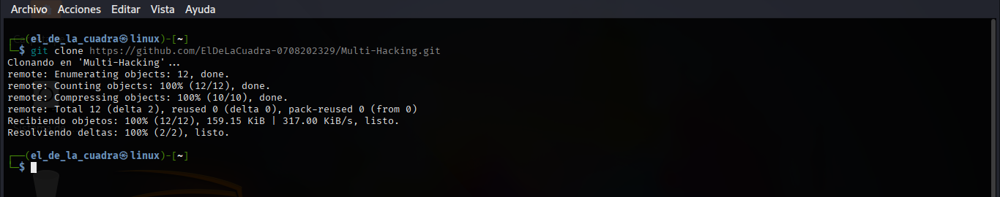

# Multi-Hacking
Sencilla herramienta creada en bash especialmente para el analisis de redes, cuenta con escaneo de puertos,servicios,vulnerabilidades,injeccion sql y escaneo web, utilizando nmap,sqlmap,whatweb,python3 y aircrack-ng, Use la herramienta en entornos controlados.(No me hago responsable por un mal uso) 
# Instalacion.
clonar el repositorio de github [Multi-Hacking](https://github.com/ElDeLaCuadra-0708202329/Multi-Hacking.git)

```sh
git clone https://github.com/ElDeLaCuadra-0708202329/Multi-Hacking.git
```
<p align="center"></p>
entrar en la carpeta creada.

```sh
cd Multi-Hacking && ls
```
<p align="center"></p>
conseder los permisos a los archivos con el siguiente comando.

```sh
chmod +x Captura.sh Multi_Hacking.sh
```
<p align="center"></p>
y por ultimo ejecute la herramienta.

```sh
sudo bash Multi_Hacking.sh
```
# Captura De Pantalla.
<p align="center"></p>
y listo estos son todos los pasos para la instalacion de Multi-Hacking.
